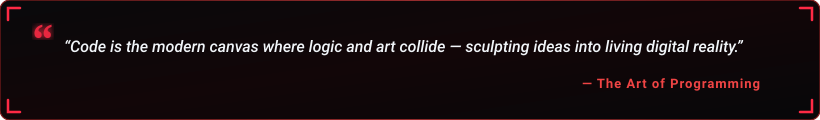

  

  

  
  &nbsp;
  
  &nbsp;
  
  &nbsp;
  
  &nbsp;
  
  &nbsp;
  

  

---

<h2 align="center">🔴 About Me</h2>

  

  

  Hey! I'm <b>Balakirushnan Jashvanth</b>, a <b>Software Engineering undergraduate</b> at the <b>University of Kelaniya</b> (Batch 21/22), based in Dalugama, Kelaniya, Colombo. 
  I'm passionate about building reliable, modern full-stack applications, and I'm open to internship and full-time opportunities.

  
  &nbsp;
  
  &nbsp;
  

  💬 <b>Let's Discuss:</b> Angular, React, .NET, Spring Boot, Cloud &amp; Web Development. 
  ⚡ <b>Focus:</b> <i>Building reliable, modern applications.</i>

<table width="100%" border="0" align="center">
<tr>
<td width="50%" align="center" style="padding: 14px;">
  <h4>🎓 Education</h4>
  
<b>University of Kelaniya</b> Software Engineering · Batch 21/22

</td>
<td width="50%" align="center" style="padding: 14px;">
  <h4>📍 Location</h4>
  
<b>Dalugama, Kelaniya</b> Colombo

</td>
</tr>
<tr>
<td width="50%" align="center" style="padding: 14px;">
  <h4>🌐 Portfolio</h4>
  
<a href="https://jashvanth370.github.io/Jashvanth_Portfolio/" target="_blank"><b>Jashvanth_Portfolio</b></a> Projects &amp; About Me

</td>
<td width="50%" align="center" style="padding: 14px;">
  <h4>✍️ Writing</h4>
  
<a href="https://medium.com/@jashvanth/" target="_blank"><b>@jashvanth on Medium</b></a> Articles &amp; Insights

</td>
</tr>
</table>

---

<h2 align="center">🔴 Projects</h2>

<table width="100%" border="0" align="center">
<tr>
<td align="center" style="padding: 22px;">
  
<i>Explore my work, including full-stack applications and other software projects, on my portfolio and GitHub.</i>

   
  

    
    &nbsp;&nbsp;
    
  

</td>
</tr>
</table>

---

<h2 align="center">🧩 LeetCode Problem Solving</h2>

  

  

---

<h2 align="center">🛠️ Tech Stack & Skills</h2>

<b>Programming Languages</b>

  

<b>Frontend &amp; Mobile Development</b>

  

<b>Backend, Cloud &amp; Databases</b>

  
   
  

<b>Tools &amp; Design</b>

  

---

<h2 align="center">📊 GitHub Analytics & Activity</h2>

  
  &nbsp;&nbsp;
  

  

  

---

<h2 align="center">⚡ Contribution Journey</h2>

  

---

<h2 align="center">📬 Let's Connect &amp; Collaborate</h2>

<i>Whether you want to discuss software engineering, explore collaboration, or just say hello, my inbox is always open!</i>

<table border="0" align="center">
<tr>
<td align="center" width="200" style="padding: 16px;">
  
   
  <b>Professional Network</b>
</td>
<td align="center" width="200" style="padding: 16px;">
  
   
  <b>Projects &amp; About Me</b>
</td>
<td align="center" width="200" style="padding: 16px;">
  
   
  <b>Articles &amp; Insights</b>
</td>
<td align="center" width="200" style="padding: 16px;">
  
   
  <b>Direct Contact</b>
</td>
</tr>
</table>

  

